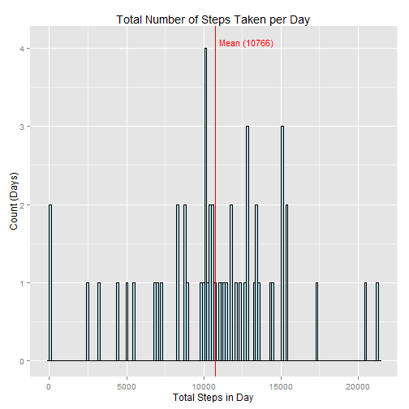
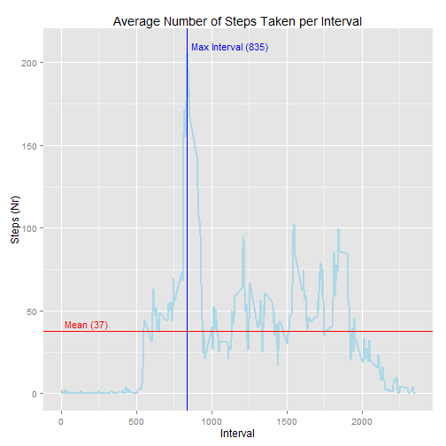
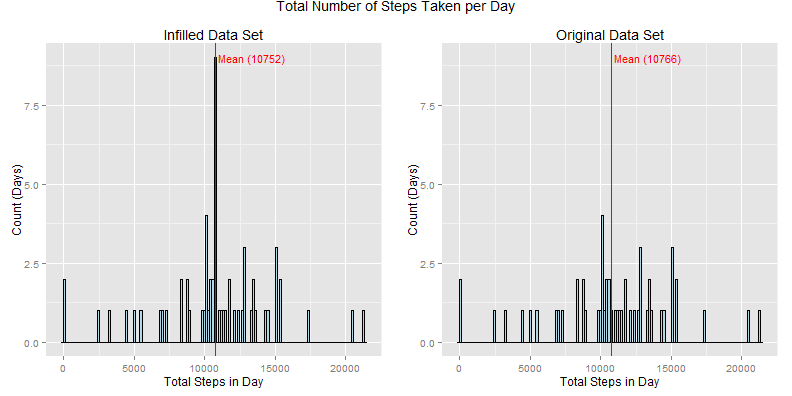
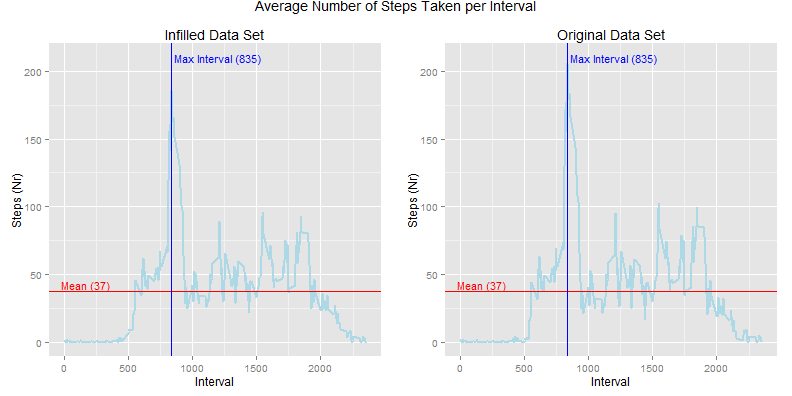
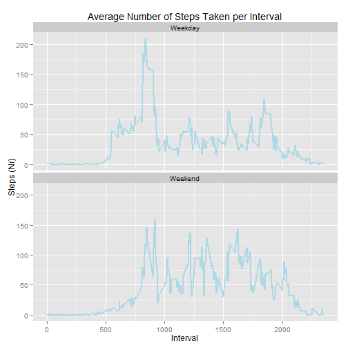

Reproducible Research
===

Assignment 1
---


```r
## Load necessary packages prior to use
require(ggplot2)
```

```
## Loading required package: ggplot2
```

```r
require(gridExtra)
```

```
## Loading required package: gridExtra
## Loading required package: grid
```

```r
## Echo on/off switch
rEcho = TRUE
```

### Part 1: "Loading and preprocessing the data"
Read in the data from the "activity.csv" file and display 10 rows from the table at random for review

```r
dfActivity <- read.csv("activity.csv", colClasses = c("numeric", "Date", "numeric"))
subset(dfActivity, row.names(dfActivity) %in% sample(row.names(dfActivity), 10))
```

```
##       steps       date interval
## 1578      0 2012-10-06     1125
## 2257     NA 2012-10-08     2000
## 3631    161 2012-10-13     1430
## 10595   110 2012-11-06     1850
## 10836     0 2012-11-07     1455
## 11401    NA 2012-11-09     1400
## 12485    56 2012-11-13      820
## 14728     0 2012-11-21      315
## 15678     0 2012-11-24     1025
## 16841     0 2012-11-28     1120
```


### Question 1: "What is mean total number of steps taken per day?"
Aggregate the activity data by taking the sum per day, ignoring the interval. Calculate the mean and median steps per day.

```r
dfActivityQ1 <- aggregate(steps ~ date, data = dfActivity, FUN = sum)
meanActiveQ1 <- mean(dfActivityQ1$steps, na.rm = TRUE)
mediActiveQ1 <- median(dfActivityQ1$steps, na.rm = TRUE)
cat("Mean number of steps per day:   ", round(meanActiveQ1),
  "\nMedian number of steps per day: ", round(mediActiveQ1), sep = "")
```

```
## Mean number of steps per day:   10766
## Median number of steps per day: 10765
```

Plot the steps per day as a histogram grouping into a bin size of 150 steps.

```r
plotActivityQ1 <- ggplot(dfActivityQ1, aes(x = steps))
     plotActivityQ1 <- plotActivityQ1 + geom_histogram(binwidth = 150, colour = "black", fill = "lightblue")
     plotActivityQ1 <- plotActivityQ1 + geom_vline(xintercept = meanActiveQ1, color = "red")
     plotActivityQ1 <- plotActivityQ1 + annotate("text", x = 12800, y = 4.075,
                                                 label = paste("Mean (", round(meanActiveQ1), ")", sep = ""),
                                                 colour = "Red", size = 4)
     plotActivityQ1 <- plotActivityQ1 + labs(title = "Total Number of Steps Taken per Day",
                                             x = "Total Steps in Day", y = "Count (Days)")
plotActivityQ1
```



### Question 2: "What is the average daily activity pattern?"
Aggregate the activity data by taking the mean per interval, ignoring the date. Calculate the mean steps per day and
the most active interval.

```r
dfActivityQ2 <- aggregate(steps ~ interval, data = dfActivity, FUN = mean)
meanActiveQ2 <- mean(dfActivityQ2$steps, na.rm = TRUE)
maxvActiveQ2 <- dfActivityQ2$interval[order(dfActivityQ2$steps, decreasing = TRUE)][1]
cat("Mean number of steps per interval: ", round(meanActiveQ2),
  "\nMost active interval (Nr steps):   ", round(maxvActiveQ2), " (", max(dfActivityQ2$steps), " steps)", sep = "")
```

```
## Mean number of steps per interval: 37
## Most active interval (Nr steps):   835 (206.2 steps)
```

Plot the average steps per interval as a line plot.

```r
plotActivityQ2 <- ggplot(dfActivityQ2, aes(x = interval, y = steps))
     plotActivityQ2 <- plotActivityQ2 + geom_line(colour = "lightblue", size = 1)
     plotActivityQ2 <- plotActivityQ2 + geom_hline(yintercept = meanActiveQ2, colour = "red")
     plotActivityQ2 <- plotActivityQ2 + geom_vline(xintercept = maxvActiveQ2, colour = "blue")
     plotActivityQ2 <- plotActivityQ2 + annotate("text", x = 170, y = 42,
                                                 label = paste("Mean (", round(meanActiveQ2), ")", sep = ""),
                                                 colour = "red", size = 4)
     plotActivityQ2 <- plotActivityQ2 + annotate("text", x = 1125, y = 210,
                                                 label = paste("Max Interval (", maxvActiveQ2, ")", sep = ""),
                                                 colour = "blue", size = 4)
     plotActivityQ2 <- plotActivityQ2 + labs(title = "Average Number of Steps Taken per Interval",
                                             x = "Interval", y = "Steps (Nr)")
plotActivityQ2
```



### Part 2: "Inputing missing values"
Determine the number of records in the data set with missing values in any of the fields

```r
cat("Number of records in the Activity data set: ", nrow(dfActivity),
  "\nNumber of records with incomplete fields:   ", sum(!complete.cases(dfActivity)))
```

```
## Number of records in the Activity data set:  17568 
## Number of records with incomplete fields:    2304
```

There are several strategies for infilling NA's in the data set. Regardless of the methodology,
infilling will introduce bias in the records that will affect the results of any analysis.

The final question for this assignment suggests there will be a difference between weekdays
and weekends. This is reasonable given typical working patters are Mon-Fri. It is also fair
to expect large differences between intervals at different times of the day, possibly due to
the daily commute. Finally, the activity pattern before 5am (500) and after 10pm (2200) in 
Question 2 shows significantly fewer steps than the rest of the day.

Taking this into account the repopulation methodology I have selected is as follows:
Intervals in the range 500 <= interval <= 2200 will revieve the average steps per interval per day.
Those outside this range will be set to zero.

```r
dfActivityP2a <- aggregate(steps ~ interval, data = dfActivity, FUN = mean)
dfActivityP2a <- subset(dfActivityP2a, interval >= 500 & interval <= 2200)
meanActiveP2a <- round(mean(dfActivityP2a$steps, na.rm = TRUE))
cat("Mean number of steps per interval: ", meanActiveP2a,
  "\n(Excluding intervals <500 and >2200)")
```

```
## Mean number of steps per interval:  52 
## (Excluding intervals <500 and >2200)
```

Repopulating the Activity data set. Start with a copy of the Activity data.frame and
infill rows where steps are NA and interval is outside the bounds defined previously.
Next, infill the remaining NA values with the mean per interval calcaulted above.

```r
dfActivity2 <- dfActivity
dfActivity2$steps <- ifelse(is.na(dfActivity2$steps) & dfActivity2$interval < 500, 0, dfActivity2$steps)
dfActivity2$steps <- ifelse(is.na(dfActivity2$steps) & dfActivity2$interval > 2200, 0, dfActivity2$steps)
dfActivity2$steps <- ifelse(is.na(dfActivity2$steps), meanActiveP2a, dfActivity2$steps)
```

Now check that the infill process worked as intended by identifying 10 random NA rows in the
Activity data and comparing them to the same rows in the duplicate version

```r
dfActiveNA <- subset(dfActivity, is.na(dfActivity$steps))
dfNArows <- row.names(subset(dfActiveNA, row.names(dfActiveNA) %in% sample(row.names(dfActiveNA), 10)))

dfActivity[dfNArows, ]
```

```
##       steps       date interval
## 41       NA 2012-10-01      320
## 56       NA 2012-10-01      435
## 195      NA 2012-10-01     1610
## 2303     NA 2012-10-08     2350
## 8946     NA 2012-11-01      125
## 9901     NA 2012-11-04      900
## 11260    NA 2012-11-09      215
## 12825    NA 2012-11-14     1240
## 12923    NA 2012-11-14     2050
## 17335    NA 2012-11-30      430
```

```r
dfActivity2[dfNArows, ]
```

```
##       steps       date interval
## 41        0 2012-10-01      320
## 56        0 2012-10-01      435
## 195      52 2012-10-01     1610
## 2303      0 2012-10-08     2350
## 8946      0 2012-11-01      125
## 9901     52 2012-11-04      900
## 11260     0 2012-11-09      215
## 12825    52 2012-11-14     1240
## 12923    52 2012-11-14     2050
## 17335     0 2012-11-30      430
```

Repeat Question 1 analysis on the infilled Activity data

```r
dfActivityP2b <- aggregate(steps ~ date, data = dfActivity2, FUN = sum)
meanActiveP2b <- mean(dfActivityP2b$steps, na.rm = TRUE)
mediActiveP2b <- median(dfActivityP2b$steps, na.rm = TRUE)
cat("Mean number of steps per day:   ", round(meanActiveP2b),
  "\nMedian number of steps per day: ", round(mediActiveP2b), sep = "")
```

```
## Mean number of steps per day:   10752
## Median number of steps per day: 10660
```

```r
## Infilled data plot
plotActivityP2a <- ggplot(dfActivityP2b, aes(x = steps))
     plotActivityP2a <- plotActivityP2a + geom_histogram(binwidth = 150, colour = "black", fill = "lightblue")
     plotActivityP2a <- plotActivityP2a + geom_vline(xintercept = meanActiveP2b, color = "red")
     plotActivityP2a <- plotActivityP2a + annotate("text", x = 13400, y = 9,
                                                 label = paste("Mean (", round(meanActiveP2b), ")", sep = ""),
                                                 colour = "Red", size = 4)
     plotActivityP2a <- plotActivityP2a + labs(title = "Infilled Data Set", x = "Total Steps in Day", y = "Count (Days)")

## Original data plot
plotActivityP2b <- ggplot(dfActivityQ1, aes(x = steps))
     plotActivityP2b <- plotActivityP2b + geom_histogram(binwidth = 150, colour = "black", fill = "lightblue")
     plotActivityP2b <- plotActivityP2b + geom_vline(xintercept = meanActiveQ1, color = "red")
     plotActivityP2b <- plotActivityP2b + annotate("text", x = 13400, y = 9,
                                                 label = paste("Mean (", round(meanActiveQ1), ")", sep = ""),
                                                 colour = "Red", size = 4)
     plotActivityP2b <- plotActivityP2b + labs(title = "Original Data Set", x = "Total Steps in Day", y = "Count (Days)")
     plotActivityP2b <- plotActivityP2b + scale_y_continuous(limits=c(0, 9))

plotTitleP2a <- textGrob("Total Number of Steps Taken per Day", gp=gpar(fontsize=14))
grid.arrange(plotActivityP2a, plotActivityP2b, ncol = 2, main = plotTitleP2a)
```



It appears that the infilling methodology has has only a minor impact on the mean (median) steps
per day; 10,752 (10,660) in the infilled data set compared to 10,766 (10,765) in the original. However,
there has been a significant increase in the frequency of days with the average number of steps; from
1 to 9...

Repeat Question 2 analysis on the infilled Activity data (not requested by assignment, just for fun)

```r
dfActivityP2c <- aggregate(steps ~ interval, data = dfActivity2, FUN = mean)
meanActiveP2c <- mean(dfActivityP2c$steps, na.rm = TRUE)
maxvActiveP2c <- dfActivityP2c$interval[order(dfActivityP2c$steps, decreasing = TRUE)][1]

## Infilled data plot
plotActivityP2c <- ggplot(dfActivityP2c, aes(x = interval, y = steps))
     plotActivityP2c <- plotActivityP2c + geom_line(colour = "lightblue", size = 1)
     plotActivityP2c <- plotActivityP2c + geom_hline(yintercept = meanActiveP2c, colour = "red")
     plotActivityP2c <- plotActivityP2c + geom_vline(xintercept = maxvActiveP2c, colour = "blue")
     plotActivityP2c <- plotActivityP2c + annotate("text", x = 170, y = 42,
                                                 label = paste("Mean (", round(meanActiveP2c), ")", sep = ""),
                                                 colour = "red", size = 4)
     plotActivityP2c <- plotActivityP2c + annotate("text", x = 1200, y = 210,
                                                 label = paste("Max Interval (", maxvActiveP2c, ")", sep = ""),
                                                 colour = "blue", size = 4)
     plotActivityP2c <- plotActivityP2c + labs(title = "Infilled Data Set", x = "Interval", y = "Steps (Nr)")

## Original data plot
plotActivityP2d <- ggplot(dfActivityQ2, aes(x = interval, y = steps))
     plotActivityP2d <- plotActivityP2d + geom_line(colour = "lightblue", size = 1)
     plotActivityP2d <- plotActivityP2d + geom_hline(yintercept = meanActiveQ2, colour = "red")
     plotActivityP2d <- plotActivityP2d + geom_vline(xintercept = maxvActiveQ2, colour = "blue")
     plotActivityP2d <- plotActivityP2d + annotate("text", x = 170, y = 42,
                                                 label = paste("Mean (", round(meanActiveQ2), ")", sep = ""),
                                                 colour = "red", size = 4)
     plotActivityP2d <- plotActivityP2d + annotate("text", x = 1200, y = 210,
                                                 label = paste("Max Interval (", maxvActiveQ2, ")", sep = ""),
                                                 colour = "blue", size = 4)
     plotActivityP2d <- plotActivityP2d + labs(title = "Original Data Set", x = "Interval", y = "Steps (Nr)")
     #plotActivityP2d <- plotActivityP2d + scale_y_continuous(limits=c(0, 9))

plotTitleP2c <- textGrob("Average Number of Steps Taken per Interval", gp=gpar(fontsize=14))
grid.arrange(plotActivityP2c, plotActivityP2d, ncol = 2, main = plotTitleP2c)
```



This plot shows very little change when comparing the original to the infilled data. Perhaps suggesting the
infill methodology, although very simplistic, is not inappropriate.

### Question 3: "Are there differences in activity patterns between weekdays and weekends?"

Start by adding an additional field to the infilled Activity data to capture whether it is the weekend
or a weekday. We will also add the weekday as another field though it is not needed for this assignment.

```r
## as.POSIXlt() returns 0 to 6 for days of the week where {0, 6} are Sunday and Saturday respecively
## Taking POSIXlt mod 6 gives zero for weekends and non-zero for weekdays
dfActivity2$period <- factor(ifelse(as.POSIXlt(dfActivity2$date)$wday %% 6 == 0, "Weekend", "Weekday"))
dfActivity2$day <- weekdays(dfActivity$date)
subset(dfActivity2, row.names(dfActivity2) %in% sample(row.names(dfActivity2), 10))
```

```
##       steps       date interval  period       day
## 4384      0 2012-10-16      515 Weekday   Tuesday
## 5448      0 2012-10-19     2155 Weekday    Friday
## 7321      0 2012-10-26     1000 Weekday    Friday
## 10676     0 2012-11-07      135 Weekday Wednesday
## 11063     0 2012-11-08      950 Weekday  Thursday
## 11422    52 2012-11-09     1545 Weekday    Friday
## 12007    22 2012-11-11     1630 Weekend    Sunday
## 13325     0 2012-11-16      620 Weekday    Friday
## 14613     0 2012-11-20     1740 Weekday   Tuesday
## 16240    14 2012-11-26      915 Weekday    Monday
```

Plot the average steps per interval as a line plot taking a facet on the period (weekend/weekday)
that was defined previously

```r
dfActivityQ3 <- aggregate(steps ~ interval + period, data = dfActivity2, FUN = mean)

plotActivityQ3 <- ggplot(dfActivityQ3, aes(x = interval, y = steps))
     plotActivityQ3 <- plotActivityQ3 + geom_line(colour = "lightblue", size = 1)
     plotActivityQ3 <- plotActivityQ3 + facet_wrap(~period, nrow = 2)
     plotActivityQ3 <- plotActivityQ3 + labs(title = "Average Number of Steps Taken per Interval",
                                             x = "Interval", y = "Steps (Nr)")
plotActivityQ3
```




